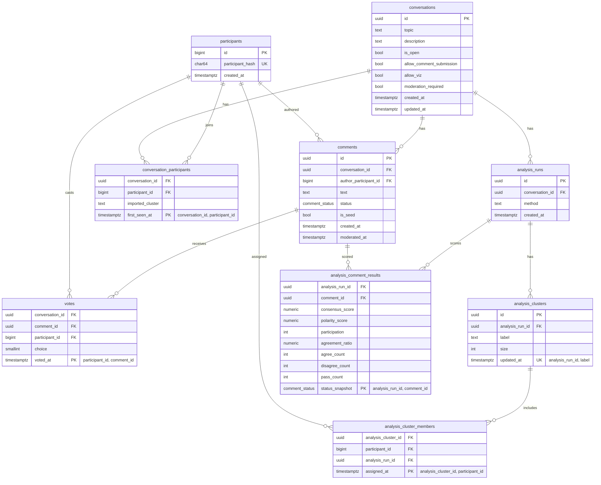

# Deliberation API: PostgreSQL Schema + Migration Strategy

## 1) Scope and design goals

This design maps the current deliberation domain (`Conversation`, `Comment`, `Participant`, `Vote`, `AnalysisRun`, `Cluster`) from Neo4j to PostgreSQL with:

- **Consistency-first modeling** (strong PK/FK/check constraints, explicit uniqueness)
- **3NF-oriented schema** for clean writes and predictable analytics inputs
- **Indexes based on observed API query patterns**, not speculative optimization
- **Alembic-first schema lifecycle** (every DDL change in versioned migrations)
- **Rollback-safe, backup-aware migration practices** for production safety

---

## 2) ERD (target relational model)



---

## 3) Normalized schema (consistency-first)

### 3.1 Domain types

- `comment_status` ENUM: `('pending', 'approved', 'rejected')`
- `vote_choice` is `smallint` with check `IN (-1, 0, 1)` (keeps ingestion flexible)

### 3.2 Core DDL (representative)

```sql
CREATE TYPE comment_status AS ENUM ('pending', 'approved', 'rejected');

CREATE TABLE conversations (
  id uuid PRIMARY KEY,
  topic text NOT NULL CHECK (char_length(topic) >= 3),
  description text,
  is_open boolean NOT NULL DEFAULT true,
  allow_comment_submission boolean NOT NULL DEFAULT true,
  allow_viz boolean NOT NULL DEFAULT true,
  moderation_required boolean NOT NULL DEFAULT false,
  created_at timestamptz NOT NULL DEFAULT now(),
  updated_at timestamptz NOT NULL DEFAULT now()
);

CREATE TABLE participants (
  id bigint GENERATED ALWAYS AS IDENTITY PRIMARY KEY,
  participant_hash char(64) NOT NULL UNIQUE,
  created_at timestamptz NOT NULL DEFAULT now()
);

CREATE TABLE conversation_participants (
  conversation_id uuid NOT NULL REFERENCES conversations(id) ON DELETE CASCADE,
  participant_id bigint NOT NULL REFERENCES participants(id) ON DELETE CASCADE,
  imported_cluster text,
  first_seen_at timestamptz NOT NULL DEFAULT now(),
  PRIMARY KEY (conversation_id, participant_id)
);

CREATE TABLE comments (
  id uuid PRIMARY KEY,
  conversation_id uuid NOT NULL REFERENCES conversations(id) ON DELETE CASCADE,
  author_participant_id bigint REFERENCES participants(id) ON DELETE SET NULL,
  text text NOT NULL CHECK (char_length(text) >= 2),
  status comment_status NOT NULL DEFAULT 'approved',
  is_seed boolean NOT NULL DEFAULT false,
  created_at timestamptz NOT NULL DEFAULT now(),
  moderated_at timestamptz
);

CREATE TABLE votes (
  conversation_id uuid NOT NULL REFERENCES conversations(id) ON DELETE CASCADE,
  comment_id uuid NOT NULL REFERENCES comments(id) ON DELETE CASCADE,
  participant_id bigint NOT NULL REFERENCES participants(id) ON DELETE CASCADE,
  choice smallint NOT NULL CHECK (choice IN (-1, 0, 1)),
  voted_at timestamptz NOT NULL DEFAULT now(),
  PRIMARY KEY (participant_id, comment_id)
);

CREATE TABLE analysis_runs (
  id uuid PRIMARY KEY,
  conversation_id uuid NOT NULL REFERENCES conversations(id) ON DELETE CASCADE,
  method text NOT NULL,
  created_at timestamptz NOT NULL DEFAULT now()
);

CREATE TABLE analysis_clusters (
  id uuid PRIMARY KEY,
  analysis_run_id uuid NOT NULL REFERENCES analysis_runs(id) ON DELETE CASCADE,
  label text NOT NULL,
  size integer NOT NULL CHECK (size >= 0),
  updated_at timestamptz NOT NULL DEFAULT now(),
  UNIQUE (analysis_run_id, label)
);

CREATE TABLE analysis_cluster_members (
  analysis_cluster_id uuid NOT NULL REFERENCES analysis_clusters(id) ON DELETE CASCADE,
  participant_id bigint NOT NULL REFERENCES participants(id) ON DELETE CASCADE,
  analysis_run_id uuid NOT NULL REFERENCES analysis_runs(id) ON DELETE CASCADE,
  assigned_at timestamptz NOT NULL DEFAULT now(),
  PRIMARY KEY (analysis_cluster_id, participant_id)
);

CREATE TABLE analysis_comment_results (
  analysis_run_id uuid NOT NULL REFERENCES analysis_runs(id) ON DELETE CASCADE,
  comment_id uuid NOT NULL REFERENCES comments(id) ON DELETE CASCADE,
  consensus_score numeric(8,6) NOT NULL,
  polarity_score numeric(8,6) NOT NULL,
  participation integer NOT NULL CHECK (participation >= 0),
  agreement_ratio numeric(8,6) NOT NULL CHECK (agreement_ratio >= 0 AND agreement_ratio <= 1),
  agree_count integer NOT NULL CHECK (agree_count >= 0),
  disagree_count integer NOT NULL CHECK (disagree_count >= 0),
  pass_count integer NOT NULL CHECK (pass_count >= 0),
  status_snapshot comment_status NOT NULL,
  PRIMARY KEY (analysis_run_id, comment_id)
);
```

---

## 4) Indexing plan (driven by current API query patterns)

| Query pattern (current routes) | Recommended index | Why |
|---|---|---|
| List conversations ordered by newest | `CREATE INDEX ix_conversations_created_at_desc ON conversations (created_at DESC);` | Supports `ORDER BY created_at DESC` without sort spill |
| List comments by conversation, optional status, ordered by created_at | `CREATE INDEX ix_comments_conversation_created_at ON comments (conversation_id, created_at, id);` and `CREATE INDEX ix_comments_conversation_status_created_at ON comments (conversation_id, status, created_at, id);` | Covers both with/without status filter |
| Cast/import votes (upsert participant+comment) | PK `(participant_id, comment_id)` on `votes` | Guarantees one vote per participant/comment and fast conflict check |
| Join votes per comment for counts | `CREATE INDEX ix_votes_comment_id ON votes (comment_id);` | Speeds per-comment aggregation |
| Participant count per conversation | `CREATE INDEX ix_conv_participants_conversation ON conversation_participants (conversation_id, participant_id);` | Fast distinct counts and membership checks |
| Analytics: all votes for one conversation | `CREATE INDEX ix_votes_conversation_comment_participant ON votes (conversation_id, comment_id, participant_id);` | Efficient extraction for matrix build |
| Latest analysis run per conversation | `CREATE INDEX ix_analysis_runs_conversation_created_desc ON analysis_runs (conversation_id, created_at DESC);` | Fast "latest run" lookup |
| Fetch scored comments for analysis run | PK on `analysis_comment_results (analysis_run_id, comment_id)` | Natural access pattern |

**Index policy:** start with the above, then validate with `pg_stat_statements` and `EXPLAIN (ANALYZE, BUFFERS)` before adding more.

---

## 5) Alembic migration plan (mandatory for every schema change)

## 5.1 Revision sequence

1. **`20260307_01_create_core_tables`**
   - Create `comment_status` enum
   - Create core tables + PK/FK/checks
   - Add minimal required indexes

2. **`20260307_02_add_operational_indexes`**
   - Add query-shape indexes listed above
   - For very large tables in production, use `CREATE INDEX CONCURRENTLY` via `op.execute(...)` in non-transactional migration

3. **`20260307_03_analysis_tables`**
   - Add analysis run/cluster/result tables + constraints/indexes

4. **`20260307_04_constraints_hardening`**
   - Add any late constraints as `NOT VALID`, then `VALIDATE CONSTRAINT` after backfill

5. **`20260307_05_retention_partitioning_optional`** (only if scale warrants)
   - Introduce partitioning for `votes` by `voted_at` month
   - Add partition management jobs

### 5.2 Data migration and cutover (Neo4j -> PostgreSQL)

- **Phase A (expand):** Deploy PostgreSQL schema and Alembic revisions.
- **Phase B (backfill):** One-time ETL script exports Neo4j nodes/edges into relational tables.
- **Phase C (dual-write):** App writes to both Neo4j + PostgreSQL; compare counts/hashes.
- **Phase D (read-switch):** Move read paths to PostgreSQL behind feature flag.
- **Phase E (contract):** Remove Neo4j write path in a later release.

### 5.3 Alembic operating rules

- No ad-hoc SQL in production outside migration files.
- Every PR with DDL must include:
  - Alembic revision
  - Upgrade + downgrade path
  - Backfill script (if needed)
  - Rollback instructions
- CI gates:
  - `alembic upgrade head` on fresh DB
  - `alembic downgrade -1` and re-upgrade
  - Drift check (`alembic current` == `head`)

---

## 6) Backup, restore, and rollback-safe practices

### 6.1 Backup/restore baseline

- **Daily physical backup + WAL archiving** for PITR.
- **Pre-migration logical backup** for targeted rollback:
  - `pg_dump --format=custom --schema=public --file=pre_<rev>.dump <db>`
- **Restore drill** at least monthly on a staging cluster:
  - restore latest base backup
  - replay WAL to target timestamp
  - run validation queries (row counts, FK violations, index validity)

### 6.2 Safe migration runbook

1. Run migration on staging with production-like volume.
2. Capture/approve `EXPLAIN` plans for critical queries.
3. Set conservative lock/statement timeouts in migration session.
4. Prefer expand/contract over destructive in-place changes.
5. Use `NOT VALID` constraints and later `VALIDATE` for large tables.
6. Build large indexes concurrently where possible.
7. Keep rollback path:
   - code-level rollback via feature flag
   - DB rollback via downgrade for additive migrations
   - for destructive migrations, restore-from-backup playbook (no blind downgrade)

---

## 7) Data retention and privacy notes

- `participants.participant_hash` stores anonymized IDs only (no raw PII).
- Recommended retention:
  - `votes`: retain 24 months hot, archive older partitions to cold storage
  - `analysis_*`: retain latest N runs per conversation (for example, N=20), purge older runs
  - `comments`: retain while conversation active; optionally soft-delete/redact by policy
- Implement retention jobs as **Alembic-managed schema + scheduled SQL jobs** (tables, partitions, archival metadata).
- Document legal basis and deletion SLAs (for example, delete/anonymize within 30 days of validated request).

---

## 8) Implementation checklist

- [ ] Add SQLAlchemy models aligned to this schema
- [ ] Initialize Alembic and create revisions listed above
- [ ] Build Neo4j -> PostgreSQL backfill script with idempotency
- [ ] Add dual-write and read-switch feature flags
- [ ] Add migration CI checks + restore drill checklist
- [ ] Add observability dashboards (`pg_stat_statements`, lock waits, bloat, dead tuples)

